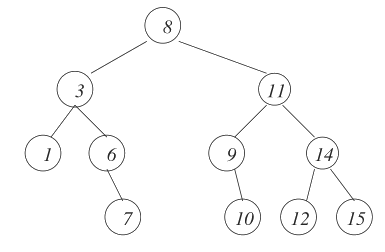
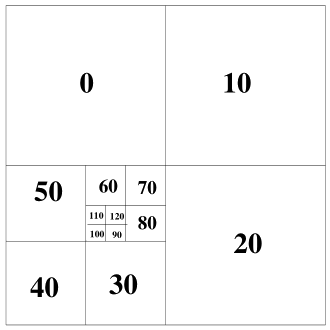

# Trees
Trees are general and powerful data
structures that resemble real trees.
A tree consists of linked nodes in a
connected graph in which each node
has at most one parent node and zero
or more children nodes with a specific
order.

## General specification
Generally trees are represented as
consisting of nodes and edges with a
tree like structure and are most
easily represented graphically.



Trees can also be defined as empty or
a node with a list of successor trees.
Nodes in a tree are usually labelled
with their data item. There always has
to be unique top level node known as
the root. The children of Node 8in the
figure above are nodes 3 and 11.
The node in the upper level connected
to another node is its parent. Nodes
that have the same parent are called
siblings. So by definition siblings
are always in the same level.
Node 6 in the figure is the descendant
of Node 8 and Node 8 is its ancestor
because it's the parent of
its parent node.

## Quad-trees
A quadtree is a type of tree such that
each leaf node is a value and each non-leaf
node has exactly four children. A quadtree
can be defined by either type of node.

The base case of a quadtree is always a
node with a value. Each induction step
requires the four children.



### Constructors

* baseQT(val) - returns a leaf node with label *value*
* makeQT(luqt,ruqt,llqt,rlqt) - returns a node with children
	*luqt*, *ruqt*, *llqt*, *rlqt*

### Selectors

* lu(qt) - returns the left-upper  QT
* ll(qt) - returns the left-lower  QT
* ru(qt) - returns the right-upper QT
* rl(qt) - returns the right-lower QT
* value(qt) - **optional selector** returns value of *qt*

### Implementation
This is the implementation of the data structure
and two most "exciting" algorithms I wrote for it.

* average - goes through a binary tree and
	gives every parent node the value
	of the average of its childs values.
* rotate - rotates the tree, at only one level
	by 90 degrees.
```c
struct node
{
	int val;
	struct node* lu;
	struct node* ll;
	struct node* ru;
	struct node* rl;
};
typedef struct node node;

int
average(node** n)
{
	if( isVal(*n) )
	{
		return val(*n);
	}
	else
	{
		int sum = 0;
		sum += average(&((*n)->lu));
		sum += average(&((*n)->ru));
		sum += average(&((*n)->rl));
		sum += average(&((*n)->ll));
		(*n)->val = sum/4;
		return sum/4;
	}
}

node*
rotate(node* qt)
{
	node* tmp = NULL;
	node* ret = qt;
	tmp = ret->lu;
	ret->lu = ret->ll;
	ret->ll = ret->rl;
	ret->rl = ret->ru;
	ret->ru = tmp;

	return ret;
}
```

## Binary trees
Binary trees are the most used tree structure
in computer science. In a binary tree every 
node has at most two children and can be
defined inductively by following the definition.
A binary tree can either be *Empty* or consist
of a single node with left and right trees as
children.

### Constructors

* EmptyTree - returns an empty tree.
* MakeTree(v, l, r) - returns a tree 
	with value *v*, pointint to
	*l* on the left and *r* on 
	the right.
* Leaf(v) - returns a leaf node
	with value *v* and pointing
	to NULL on both the left and
	right.

### Selectors

* root(t) - returns the value of *t*
* left(t) - returns the left subtree of *t*
* right(t) - returns the right subtree of *t*

### Implementation

```c
struct node
{
	int val;
	struct node* left;
	struct node* right;
};
```

### Height of binary trees
There is no simple relation between
the size and height of a binary tree.
The maximum height of a binary tree is
n-1 (n is the size) and that happens
when all non-leaf nodes of a binary tree
have exactly one child, effectively
forming a linked list.

Suppose we have n nodes of binary tree and
want to construct a binary tree with minimal
height. I assume this is achieved by filling
every level before jumping to the next.

The maximum number of nodes that can fit
into a binary tree can be found using the
formula s(h)=2<sup>h+1</sup>-1
